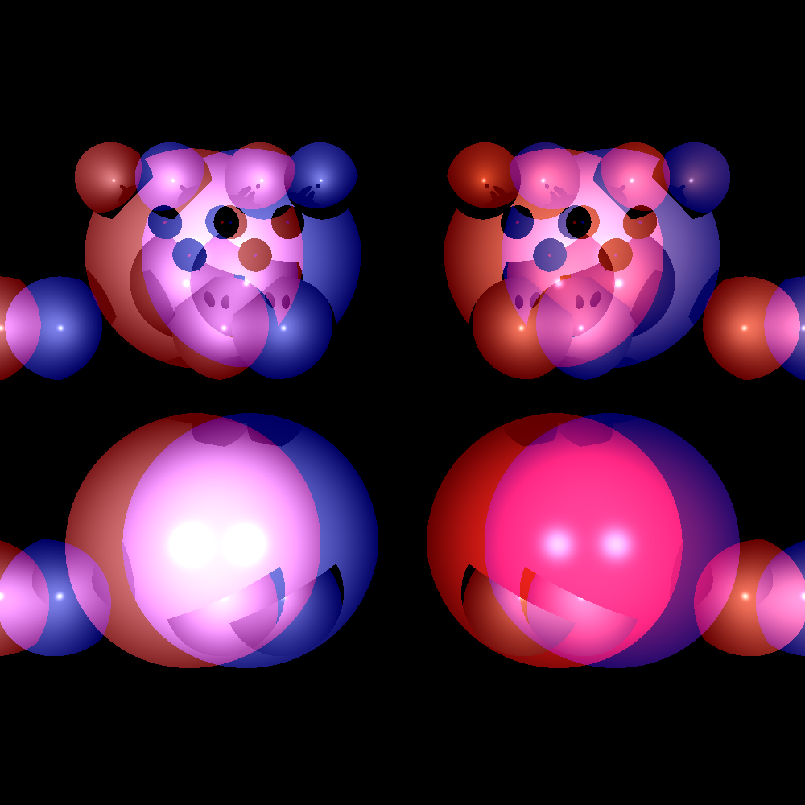

# Lab-3-Stereographic-rendering

#Para éste lab, tomen alguna imagen simple, puede ser solo una esfera o puede ser alguno de sus ejercicios pasados. Traten de crear una imagen estereoscopica.

#Lab numero 2 utilizado

